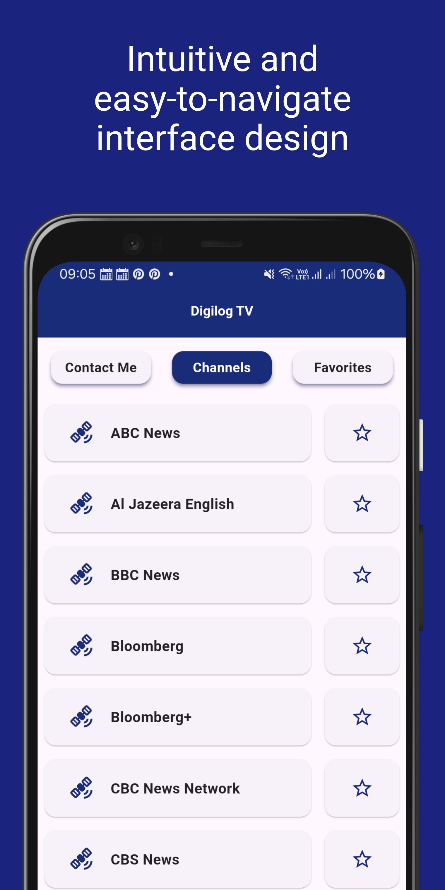

# Digilog TV

Or download the latest APK from the [Releases Section](https://github.com/aldrinzigmundv/digilogtv/releases/latest)

**This app is powered by [aldrinzigmund.com](https://www.aldrinzigmund.com/)**

## What is Digilog TV?

A free and open-source TV news app, inspired by Linux Mint's Hypnotix.

The app features English news channels from all around the world, sourced from Free-TV/IPTV on GitHub, just like Hypnotix, to ensure that it only includes free, legal and publicly available content.

For news channel suggestions, please file an issue on both Free-TV/IPTV and our GitHub repo. I'll include suggested news channels that meet our criteria as soon as Free-TV/IPTV adds them to their list.

## Features
* Free and open-source
* Intuitive and easy-to-navigate interface design
* Offers a diverse selection of global news channels
* Convenient favorites list for quick access to your preferred channels
* Includes only free, legal, and publicly available content
* Non-disruptive ads (Play Store version only) to support future development plans

## Donate XMR to Support Maintaining this App

Donate XMR to Support this App

86cQoPfKTJ2bRfGH5Ts2kzaXCRcVRiX8CUHKc9xmeUmQ8YM8Uzk9S97T5gQaqYu58C9wuFK7opDH7cM9EJyR4V5LAq9RGv4
